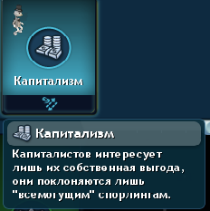

# Главная страница
**Здесь вы можете найти моды для Spore на любой вкус и цвет от автора BelogvardeeX**
### Моды:
- ## [Archetype Overhaul(RU)](https://github.com/belogvardeec-belich/spore-mods/raw/main/mods/!!!ArchetypeOverhaul_RU.package)
  

  Данный мод изменяет названия архетипов(философий), на более реалистичные, близкие к реальным прототипам. К примеру:
  - Воин -> Фашизм
  - Шаман -> Социализм/коммунизм
  - Фанатик -> Теократия
  - Рыцарь -> Монархия...

- ## [Combat Expansion](https://github.com/belogvardeec-belich/spore-mods/raw/main/mods/!!!ArchetypeOverhaul_RU.package)
  Мод изменяющий множество параметров связанных с боёвкой на этапе космос, вот основные изменения:
  - У кораблей пиратов в 5 раз больше здоровья
  - На сложной сложности катастрофы появляются немного чаще
  - Здоровья вражеских кораблей на сложном уровне сложности увеличены в 3 раза
  - Вражеские империи посылают подкрепления сильнее и чаще
  - Вражеские империи труднее принудить к капитуляции
  - Теперь у ИИ империй есть свои черты, но особо это на геймплей не влияет
